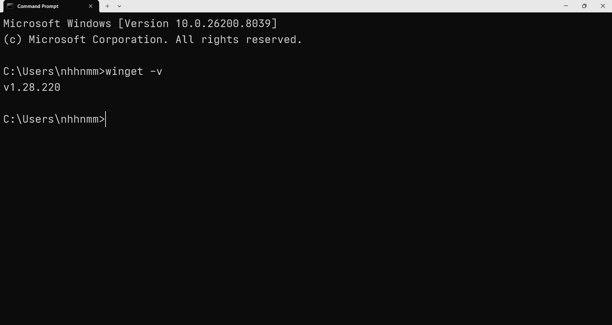

# Hướng dẫn cài đặt OpenClaw trên Windows

## Cài đặt công cụ cần thiết

### Cài đặt Winget (Windows Package Manager)

Winget (Windows Package Manager) thường được tích hợp sẵn trên Windows 11 và Windows 10 (phiên bản mới).

1. Mở **Command Prompt**, gõ `winget -v`. Nếu hiện số phiên bản, bạn đã có winget.

    

2. Nếu chưa có, truy cập Microsoft Store, tìm kiếm **"App Installer"** và nhấn "Cập nhật" (Update) hoặc "Cài đặt" (Install).

    


### Cài đặt Node.js

1. Mở **Command Prompt** dưới quyền Administrator (Chuột phải -> Run as administrator).
2. Chạy lệnh sau:

    ```bash
    winget install -e --id OpenJS.NodeJS
    ```

    

3. Nếu có các thỏa thuận cấp phép (licence agreements), gõ `Y` hoặc nhấn Enter để đồng ý và tiếp tục.
4. Sau khi cài đặt xong, hãy đóng và mở lại **Command Prompt**, sau đó kiểm tra phiên bản bằng lệnh:

    ```bash
    node -v
    npm -v
    ```

    


## Cài đặt và thiết lập OpenClaw

### Cài đặt

1. Mở **Command Prompt** và chạy lệnh sau:

    ```bash
    npm install -g openclaw@latest

    ```

    

2. Mở **Command Prompt**, gõ `openclaw -v`. Nếu hiện số phiên bản, bạn đã có OpenClaw.

    


### Thiết lập ban đầu

#### Thao tác

- Dùng mũi tên (**←**/**→**) để di chuyển trái/phải
- Dùng mũi tên (**↑**/**↓**) để di chuyển lên/xuống
- Nhấn `Space` để chọn các lựa chọn bắt đầu bằng **⃞**
- Nhấn `Enter` để xác nhận lựa chọn

#### Chạy thiết lập

```bash
openclaw onboard --install-daemon
```

1. **I understand this is personal-by-default and shared/multi-user use requires lock-down. Continue?**

    Chọn `Yes`

    

2. **Setup mode**

    Chọn `QuickStart`

    

3. **Model/auth provider**

    Chọn `OpenRouter`

    

4. **Enter OpenRouter API key**

    Nhập `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`

    

5. **Default model**

    Chọn `openrouter/stepfun/step-3.5-flash`

    

6. **Select channel (QuickStart)**

    Chọn `Skip for now`

    

7. **Search provider**

    Chọn `Skip for now`

    

8. **Configure skills now? (Recommended)**

    Chọn `No`

    

9. **Enable hooks?**

    Chọn `Skip for now`

    

10. **How do you want to hatch your bot?**

    Chọn `Do this later`

    


Sau khi hoàn tất các lựa chọn, bạn đã thiết lập ban đầu thành công.


**Lưu ý:** Sau lựa chọn 9, OpenClaw sẽ tự động mở cửa sổ terminal mới để chạy gateway, nếu không tự động mở, có thể mở thủ công

```bash
openclaw gateway
```


Đảm bảo gateway luôn được mở để sử dụng OpenClaw và OpenClaw có thể tự thao tác trên Windows.

### Sử dụng Dashboard

Mở **Command Prompt** và nhập lệnh sau

```bash
openclaw dashboard
```

Dashboard sẽ được mở tự động trên trình duyệt


Nếu không tự động mở, sao chép URL và mở trong trình duyệt


### Sử dụng kênh chat

Sẽ có nhiều kênh để bạn có thể sử dụng, trong hướng dẫn này sẽ dùng Telegram.

#### Thiết lập kênh chat Telegram

Mở **Command Prompt** và nhập lệnh sau (cách lấy bot token được hướng dẫn bên dưới).

```bash
openclaw channels add --channel telegram --token <bot-token>
```


#### Cách lấy bot token

1. Mở Telegram, tìm kiếm BotFather và nhấn Start

    

2. Nhập `/newbot` vào khung chat, nhấn `Enter`

    

3. Đặt tên cho bot

    

4. Chọn username cho bot, lưu ý phải kết thúc bằng `bot`

    

5. Bot token sẽ được hiển thị trong khung chat, sao chép và sử dụng cho lệnh trên

    


#### Cách ghép nối OpenClaw với Telegram Bot

Để Telegram Bot vừa tạo tương tác thay OpenClaw, cần ghép nối chúng.

Mở **Command Prompt** và nhập lệnh sau (cách lấy code được hướng dẫn bên dưới)

```bash
openclaw pairing approve telegram <code>
```


#### Cách lấy code

1. Mở Telegram, tìm kiếm username bot vừa tạo, nhấn Start

    

2. Sao chép code hiển thị trong khung chat và dùng cho lệnh trên

    


## Tổng kết

Hướng dẫn trên đã hoàn thành các bước cài đặt và thiết lập OpenClaw hoạt động thông qua kênh chat Telegram
